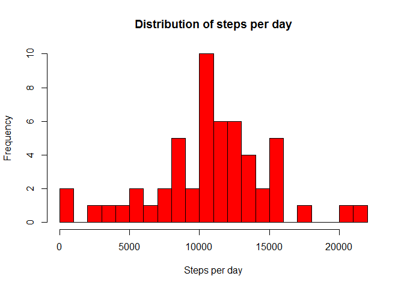
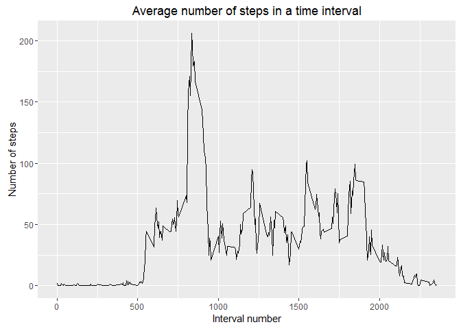

# Reproducible Research: Peer Assessment 1
## Required libraries

```r
library(ggplot2)
```


## Loading and preprocessing the data

```r
d0 <- read.csv("activity.csv")

d1 <- na.omit(d0)

d1$date <- as.Date(d1$date)

# total number of steps for a day
totalSteps <- tapply(d1$steps, d1$date, sum)
```


## What is mean total number of steps taken per day?
### Histogram of the total number of steps taken each day

```r
hist(totalSteps, 
        main = "Distribution of steps per day", 
        xlab="Steps per day", 
        ylab="Frequency", 
        col = "red", 
        breaks = 25
    )
```

 


### mean and median of the total number of steps taken per day

```r
# mean of total Steps
mean(totalSteps)
```

```
## [1] 10766.19
```


```r
# median of total Steps
median(totalSteps)
```

```
## [1] 10765
```


## What is the average daily activity pattern?

### time seris plot of the interval and average number of steps taken in that interval 


```r
d2 <- aggregate(steps ~ interval, d1, mean)

par(mar = c(1.5, 1.5, 1, 1))

g1 <- ggplot(d2, aes(interval, steps)) + geom_line() +
        ggtitle("Average number of steps in a time interval") +
        xlab("Interval number") +
        ylab("Number of steps")

# plot the graph
g1
```

 

### which 5 minute interval on average across all days containes the maximum number of steps

```r
# our data set already has the average number of steps for the interval
d2[which.max(d2$steps),]
```

```
##     interval    steps
## 104      835 206.1698
```


## Imputing missing values


## Are there differences in activity patterns between weekdays and weekends?

