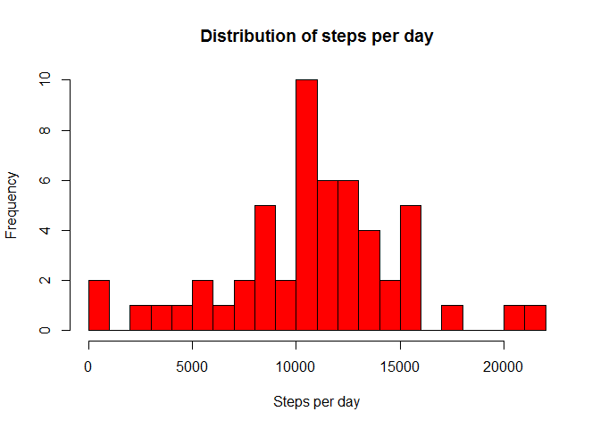
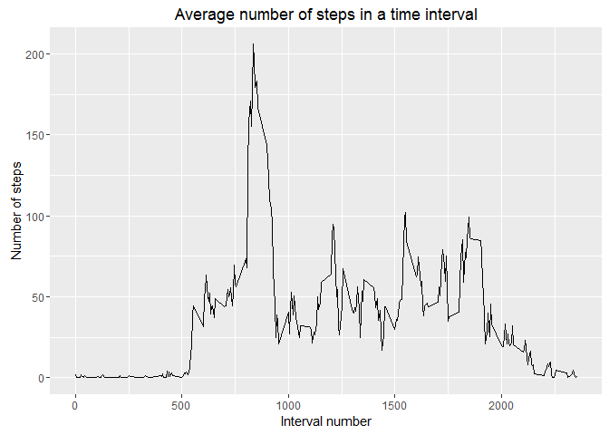
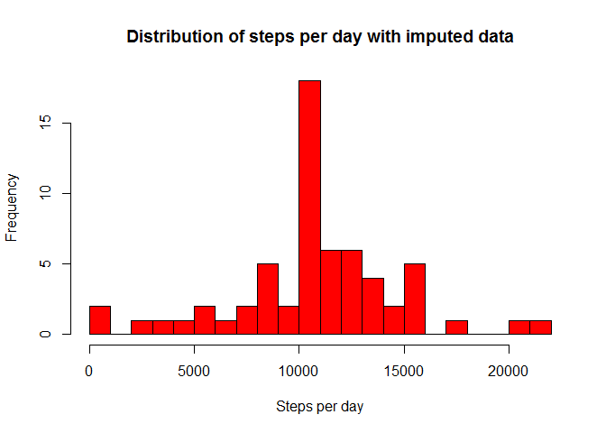
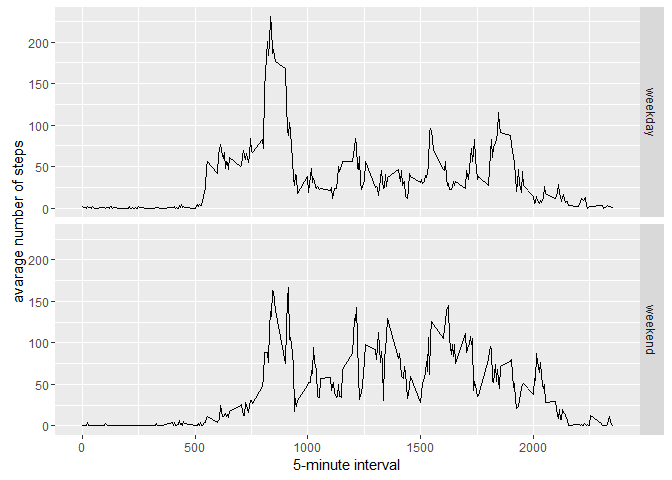

# Reproducible Research: Peer Assessment 1
## Required libraries

```r
library(ggplot2)
```


## Loading and preprocessing the data

```r
d0 <- read.csv("activity.csv")
d0$date <- as.Date(d0$date)

d1 <- na.omit(d0)


# total number of steps for a day
totalSteps <- tapply(d1$steps, d1$date, sum)
```


## What is mean total number of steps taken per day?
### Histogram of the total number of steps taken each day

```r
hist(totalSteps, 
        main = "Distribution of steps per day", 
        xlab="Steps per day", 
        ylab="Frequency", 
        col = "red", 
        breaks = 25
    )
```

 


### Mean and median of the total number of steps taken per day

```r
# mean of total Steps
mean(totalSteps)
```

```
## [1] 10766.19
```


```r
# median of total Steps
median(totalSteps)
```

```
## [1] 10765
```


## What is the average daily activity pattern?

### Time seris plot of the interval and average number of steps taken in that interval 


```r
d2 <- aggregate(steps ~ interval, d1, mean)

par(mar = c(1.5, 1.5, 1, 1))

g1 <- ggplot(d2, aes(interval, steps)) + geom_line() +
        ggtitle("Average number of steps in a time interval") +
        xlab("Interval number") +
        ylab("Number of steps")

# plot the graph
g1
```

 

### Which 5 minute interval on average across all days containes the maximum number of steps

```r
# our data set already has the average number of steps for the interval
d2[which.max(d2$steps),]
```

```
##     interval    steps
## 104      835 206.1698
```


## Imputing missing values
### Calculate and report the total number of missing values in the dataset

```r
sum(is.na(d0$steps))
```

```
## [1] 2304
```

### strategy for filling in all of the missing values in the dataset
We will use the average number of steps for the interval as replacement for missing value


```r
## function to return the replacement for the missing value
find.missing.val <- function(steps, interval){
                        calculated_steps <- NA
                        if (is.na(steps))
                            calculated_steps <- d2[d2$interval==interval, "steps"]
                        else
                            calculated_steps <- steps
                        return(calculated_steps)    
                    }

# Create a new dataset equal to the original but with the missing values filled in
d3 <- d0
d3$steps <-mapply(find.missing.val, d3$steps,d3$interval)
```

Number of missing values in the new data set

```r
sum(is.na(d3$steps))
```

```
## [1] 0
```


Histogram of the total number of steps taken each day

```r
totalSteps_imputed <- tapply(d3$steps, d3$date, sum)
hist(totalSteps_imputed, 
        main = "Distribution of steps per day with imputed data", 
        xlab="Steps per day", 
        ylab="Frequency", 
        col = "red", 
        breaks = 25
    )
```

 


### Mean and median of the total number of steps taken per day

```r
# mean of total steps based on imputed data
mean(totalSteps_imputed)
```

```
## [1] 10766.19
```


```r
# median of total steps based on imputed data
median(totalSteps_imputed)
```

```
## [1] 10766.19
```

Do these values differ from the estimates from the first part of the assignment? 

```r
# difference in mean
mean_diff <- mean(totalSteps) - mean(totalSteps_imputed)
print(mean_diff)
```

```
## [1] 0
```


```r
# difference in median
median_diff <- median(totalSteps) - median(totalSteps_imputed)
print(median_diff)
```

```
## [1] -1.188679
```

What is the impact of imputing missing data on the estimates of the total daily number of steps?  
Change in mean   = 0  
Change in median =  -1.1886792  


## Are there differences in activity patterns between weekdays and weekends?
Create a factor variable "day" in data set for weekdays and weekends

```r
d4 <- d3

d4$day <- factor(ifelse(as.POSIXlt(d4$date)$wday %in% c(0,6), "weekend", "weekday"))
```

calculate the averaged number of steps taken by "weekday"" or "weekend":

```r
d5 <- aggregate(steps ~ interval + day , data = d4 , mean)
```

Plot the graph

```r
g2 <- ggplot(d5, aes(interval, steps)) + 
        geom_line() + 
        facet_grid(day ~ .) +
        xlab("5-minute interval") + 
        ylab("avarage number of steps")

g2
```

 


